<p align="center">
  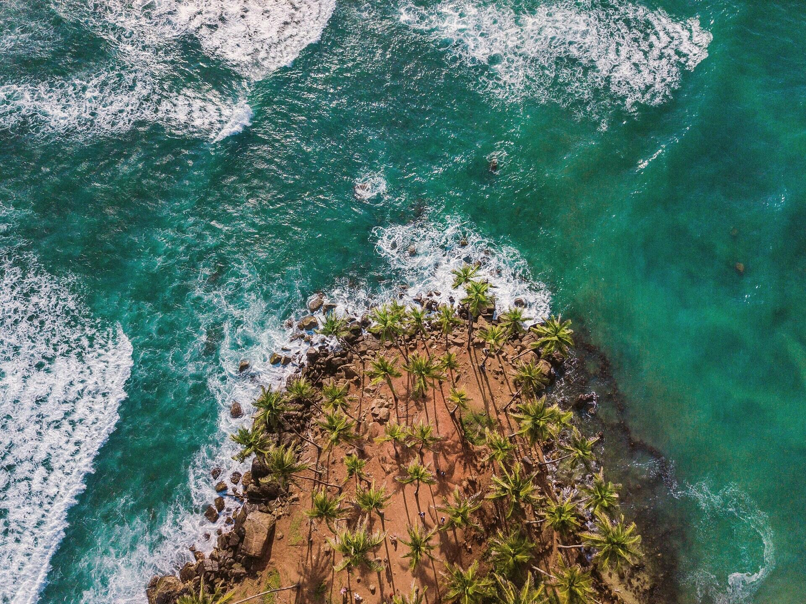
</p>

# South Coast '26 — the first Bro Knows A Spot trip

Eight days down Sri Lanka's golden strip. **Ahangama → Weligama → Mirissa → Hiriketiya**,
four villas, twenty-one seats, 1–8 September 2026. ₹50,000 a head, and the price list
tells the truth: villas, transfers, a scooter under you all week, one spa session, one
surf lesson, one sauna + ice bath — food, bar tabs and flights are on you. No food kitty.
No drinks bucket.

This repo is the trip's website.

## The site

Static, single page, **zero frameworks and zero runtime dependencies**. Everything the
page does is hand-rolled:

- Cream preloader with the Sunburst mark that slides away on load
- Floating pill navigation with a burger drawer on mobile
- Scroll-snap card slider for the four bases (no slider library)
- `IntersectionObserver`-driven reveal animations, `prefers-reduced-motion` respected
- Film-grain overlays, marquee ticker, color-blocked sections — all CSS
- Route map drawn from real OpenStreetMap-derived coastline data (SVG)
- **Real interactive map** — lazy-loaded Leaflet + OSM, star pins, the route as actually driven
- Zine furniture throughout: typewriter mono metadata, coordinates, postage-stamp photo frames, handwritten asides, rubber stamps
- Dedicated motion layer: masked headline rises, parallax, count-ups, ambient section fades

The visual system comes from the [Bro Knows A Spot brand kit](https://github.com/Piyushmishra29/bro-knows-a-spot):
cream `#F2E9CE` · ink `#221A12` · terracotta `#B4502A` · Shrikhand for the loud parts ·
Archivo for everything else.

## The spots

<table>
  <tr>
    <td>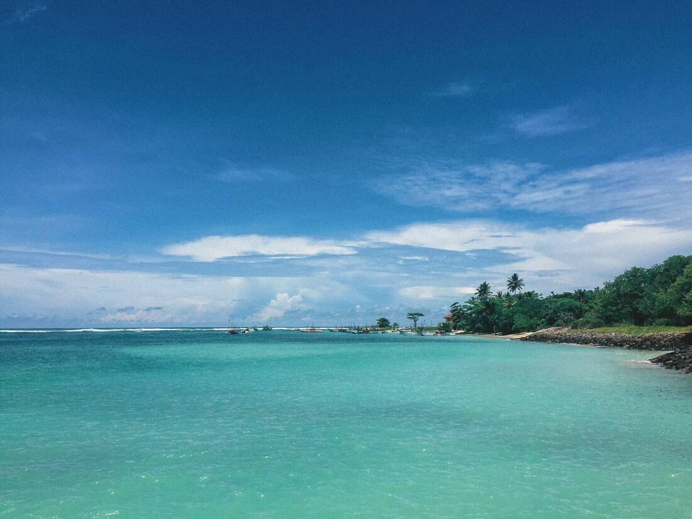</td>
    <td>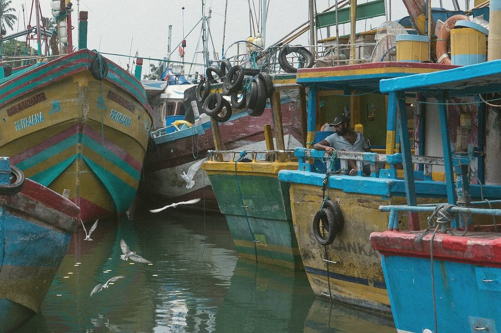</td>
    <td>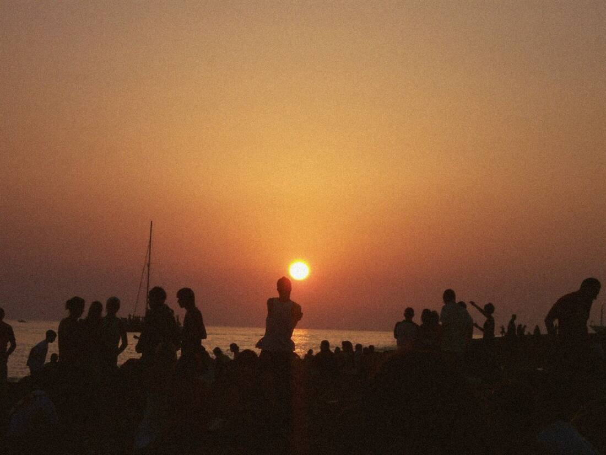</td>
  </tr>
  <tr>
    <td>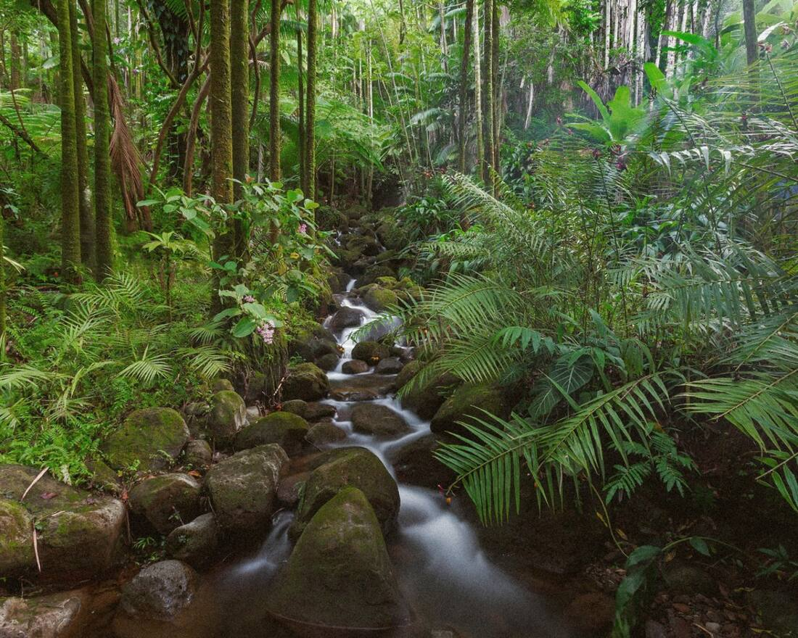</td>
    <td>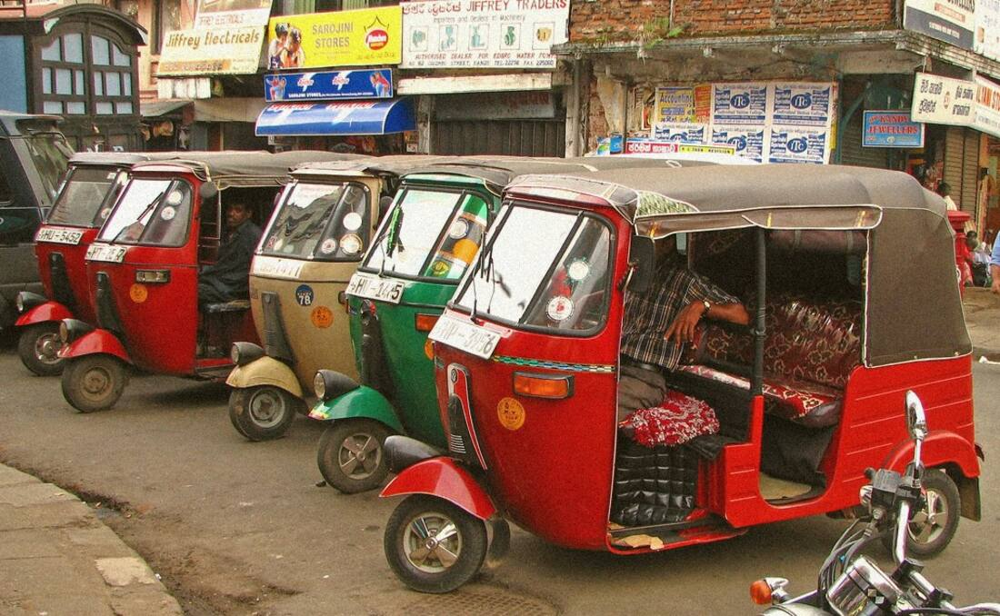</td>
    <td>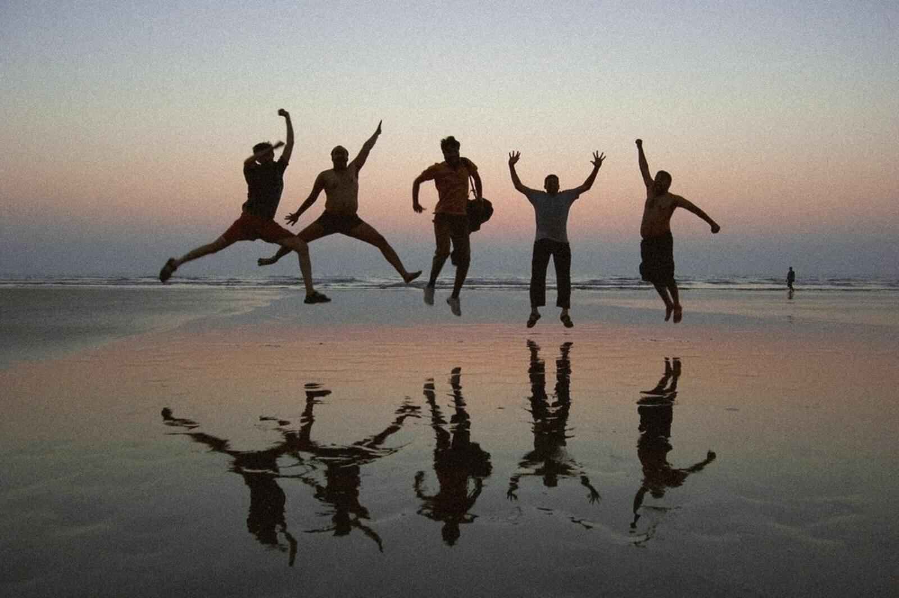</td>
  </tr>
</table>

## Run it

```bash
python3 -m http.server 8080   # or any static server
# open http://localhost:8080
```

Deploy = upload the folder to any static host. That's the whole pipeline.

## Structure

```
index.html          # assembled page (open this)
css/                # base.css tokens + one stylesheet per section
js/                 # site.js (reveals) + per-section scripts
sections/           # build-time HTML fragments (01-chrome … 07-closing)
assets/
  img/              # trip photography (film-graded)
  brand/            # Sunburst logo SVGs (outlined paths)
  fonts/            # Shrikhand + Archivo variable (OFL)
```

`index.html` is assembled from `sections/` by a small build script; edit a section
fragment and re-assemble, or just edit `index.html` directly if you're quick-fixing.

## Screenshots

<table>
  <tr>
    <td width="60%">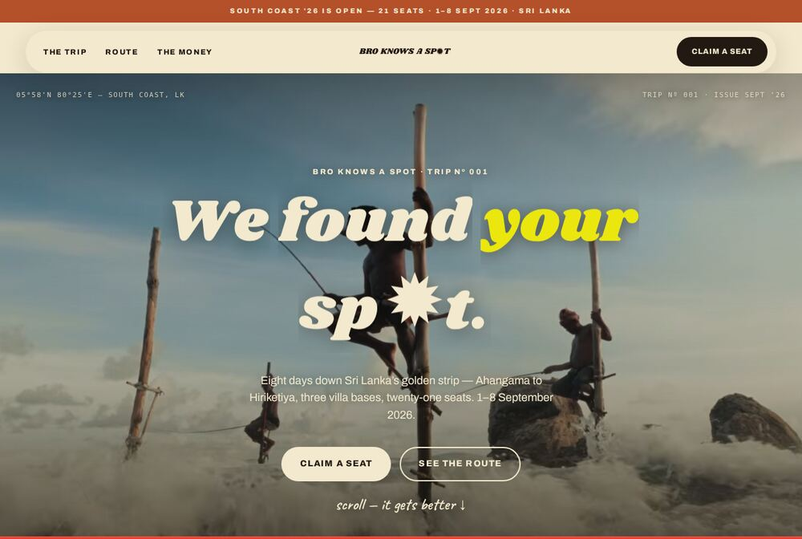</td>
    <td rowspan="2">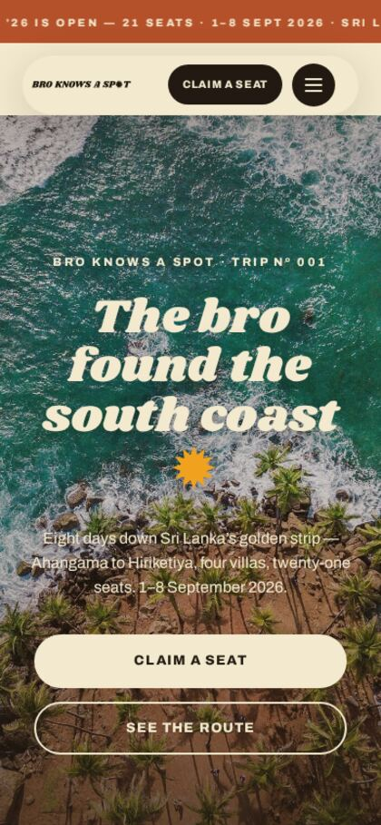</td>
  </tr>
  <tr><td>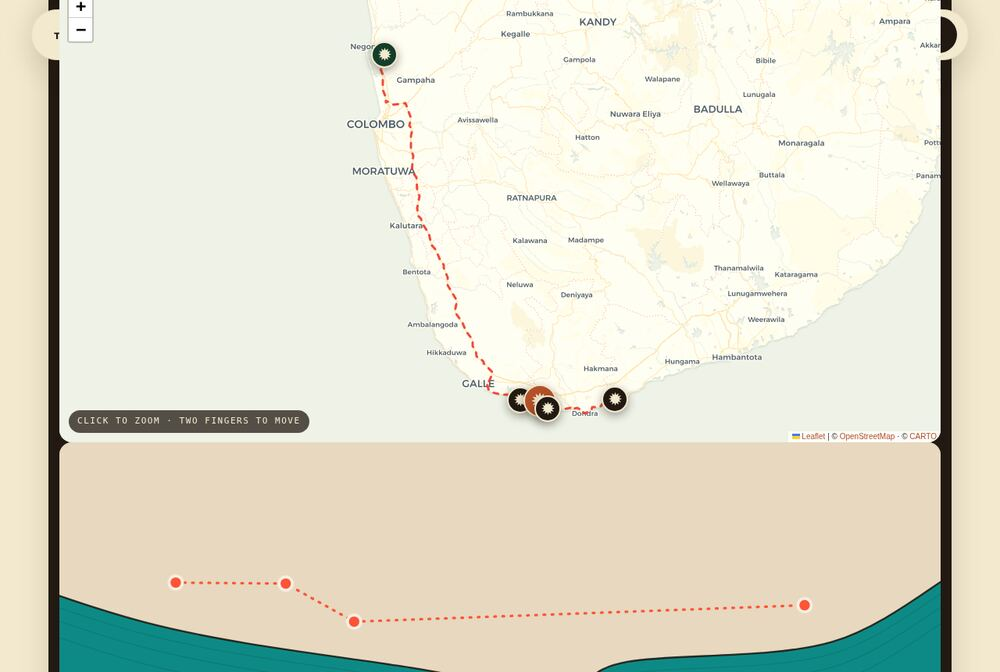</td></tr>
  <tr><td>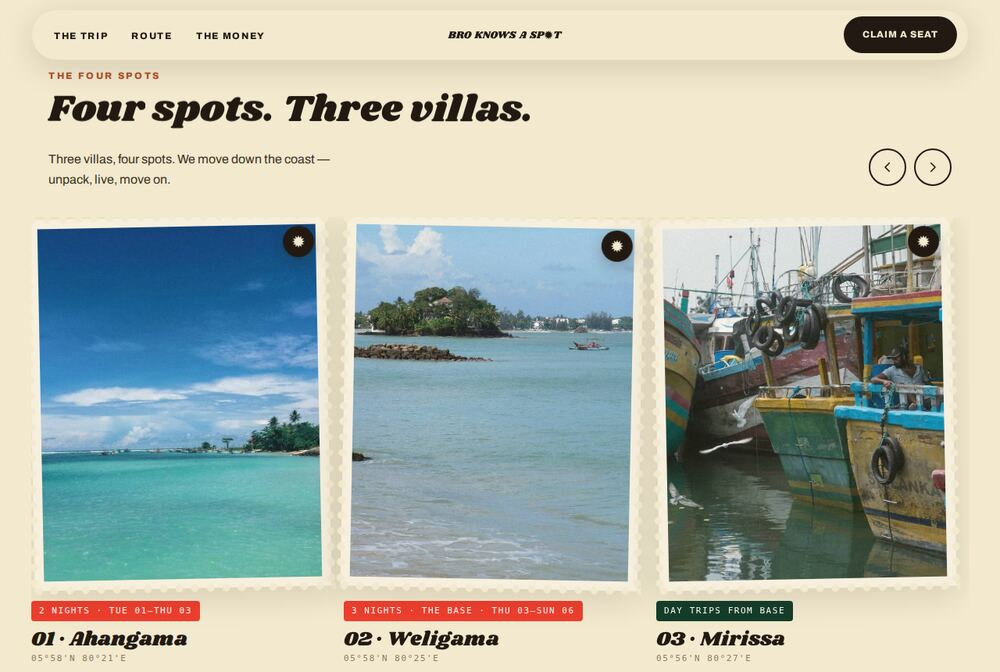</td>
      <td>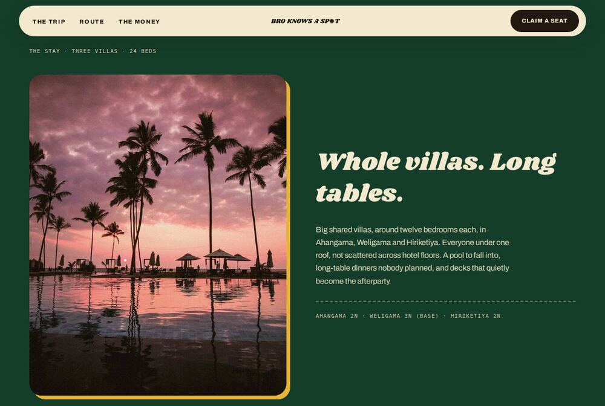</td></tr>
</table>

## Credits

Photography: Wikimedia Commons & Openverse contributors (CC licenses).
Fonts: Shrikhand, Archivo — SIL Open Font License.
Brand: [Bro Knows A Spot](https://github.com/Piyushmishra29/bro-knows-a-spot).

---

<p align="center"><i>Worth the detour.</i></p>
